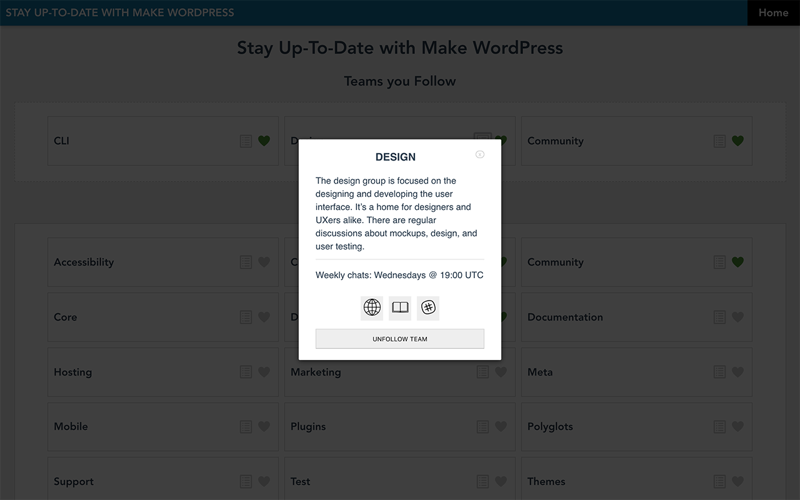

# Make WordPress app

**CURRENTLY UNDER DEVELOPMENT**

Vue.js Progressive Web App to allow the WordPress community to stay up-to-date with the Open Source Contributor teams.

As it stands, the system allows the user to:
* view a list of all WordPress Contributor teams,
* view a brief description of each team, including their weekly office hours and links to the Handbook, website and Slack channel.
* select which teams they wish to follow, and
* read the last 10 blog posts of each followed team.

When completed, the app will also remember when the user last viewed each team and notify them if new blog posts have been published since then.


## Preview

Here are some screenshots of the various sections at the current stage of development:


_Three WordPress Contributor Teams Selected_


_The Design Team details_


_Some of the Design Team latest Blog Posts_


## Technical Description

The app uses the [Make WordPress](https://make.wordpress.org) **Rest API** and it is built with the **Vue CLI**, **Vuex**, **Axios**, **Vue Router** and, currently, **localStorage**.

Work is underway to migrate to **IndexedDB** and convert the system to a **PWA** in order to make it available off-line and provide notifications.

**Cypress** is used for end-to-end testing and **Mocha** for unit tests.

Expected to be live by mid-May 2019.


## Project setup

```
npm install
```

### Compiles and hot-reloads for development
```
npm run serve
```

### Compiles and minifies for production
```
npm run build
```

### Run your End to End tests
```
npm run test:e2e
```

### Run your unit tests
```
npm run test:unit
```

### Lints and fixes files
```
npm run lint
```

### Customize configuration
See [Configuration Reference](https://cli.vuejs.org/config/).
